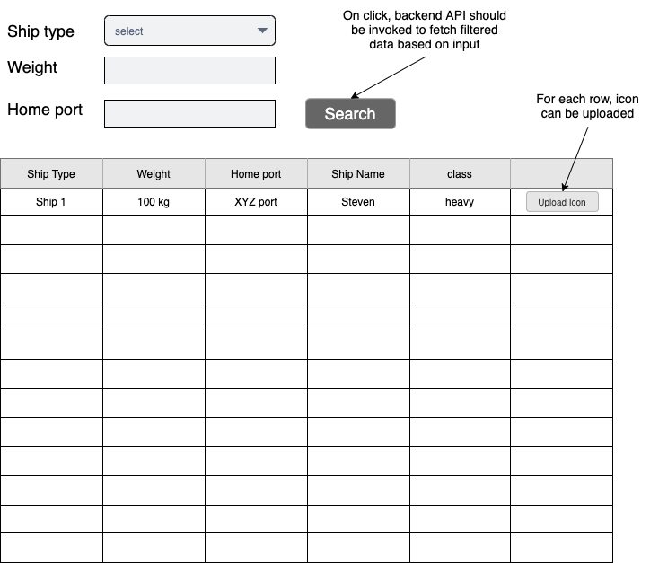

The dashboard has the following requirements: 

## Client

* A basic html to show data returned from the backend API in a tabular format.
* It can have pagination.
* Ability to filter data based on attributes like ship type (dropdown), weight (numeric), home port (string).
* The control console (the buttons container) should be positioned just above the table as shown in image below.
* The control console should provide a button that fetches All ships.
* Should provide a button for each row to allow the engineers to upload ship icon/image (only jpg/jpeg,png allowed and upto size 100kb).

## Server
​
* Create a secure API to fetch ships from local database
* Before returning response check data in cache, if found return from cache
* If not found in cache, query from database
* If record not found in database, call spaceX API and store in local database
* Local database record gets stale in every 24 hours, should be refreshed every 24 hrs
* API to support ship type, weight, home port filters (bonus point for pagination in api)
* an upload ship icon/image which shall upload image to server and store it as a ship attribute and also shall be returned in list/get api.
* server side validations of input data
​
## Bonus points:
​
* Use of react (++)
* Pagination in api. (+++)
* Use redux as state management. (+++)
* Add validation for the input field: data type ,range, select list. (+)
* Try to keep a clean commit history. (++)
* The client should be bundled using webpack and non CRA and ready for production. (+++)
* Test case for at least of one api/service methods. (++)

See UI mock below

