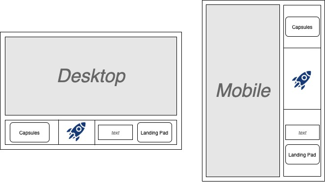

# We are building a space airport - Tech Challenge

We have been very busy for the past 12 months building aircraft hangars, digging safety tunnels and shafts, closing deals with NASA, SpaceX and ISA. Everything is almost ready and as a consequence of our partnership with SpaceX, we need to build our Ground Control flight dashboard to support their needs.

Elon Musk’s engineers have provided us with the specs of their APIs and you can find it here https://docs.spacexdata.com

The dashboard has the following requirements: 

## Client

* For desktop devices, it should be centred both vertically and horizontally and take up half the width and half the size of the window.
* For tablets and mobile devices it should take up the full width and full height of the screen.
* Should have a control console with buttons and a display console to show the results generated by those buttons (A simple prettified JSON output).
* The display console should take up the 2/3 of the total height of the dashboard for desktop devices and 2/3 of the total width of the dashboard for tablets and mobile devices. Said display should be scrollable only vertically and break lines if the lines are too long to fit.
* The control console (the buttons container) should be positioned underneath the display console for desktop devices and on the right side of the display for tablets and mobile devices.
* The control console should provide a button that fetches all Upcoming Capsules, sorted by capsule original launch date. The button content is simply a “Capsules” label and said label should be centered both vertically and horizontally.
* Should provide an input text field and a button to allow the engineers to fetch the data of a Landing Pad by its id. The width of the text input is fixed to 15 characters. Be “Landing Pad” be the button label, centered both vertically and horizontally.
* Upcoming Capsules, the little rocket svg and Landing Pad should be equally spaced, for desktop devices aligned from left to right and in tablet and mobile devices from top to bottom.

## Server

* Should handle ALL requests coming from the dashboard and should be the only entity interacting with the SpaceX API.
* Should validate Landing Pad requests and return an appropriate error if id is not supplied.
* Should store the results of the Landing Pad requests in the spaceData table. If the Landing Pad is found in the table, no request to SpaceX servers should be made and the stored result should be returned instead.
* For the Landing Pad response only return id, full_name, status, location fields.

## Bonus points:

* Use hooks for your implementation. (++)
* Use redux as state management. (+++)
* Add validation for the Landing Pad input field: any of [‘#’,’$’,’%’,’&’] chars will fail the validation and if so the button should be disabled.
* Try to keep a clean commit history. (++)
* The client should be bundled using webpack and non CRA and ready for production. (+++)

See UI mock below

## Getting Started
We have provided a bit of boilerplate code that you can use to get started.  You are **not** required to use this boilerplate, so feel free to throw it all away and start fresh if you prefer.

The boilerplate code assumes you have Docker running on your machine.  If you do not, they offer easy to install binaries ([Mac](https://docs.docker.com/docker-for-mac/install/)) ([Windows](https://docs.docker.com/docker-for-windows/install/)).

From the docker folder of the project, run `docker-compose up -d`
* You should now have the UI running at http://localhost:3000 and the server running at http://localhost:4000
* You should now have a MySQL database running at localhost:3306

**The time recommended is 2-3 hours, try not to spend longer than that, we don’t want you to waste a precious day of your life over this. More importantly, you do not necessarily need to complete every point, we want to see how you work and how far you get, we are not actually sending rockets into space (not yet).**

**Please commit your code to Github and share the link with us.**